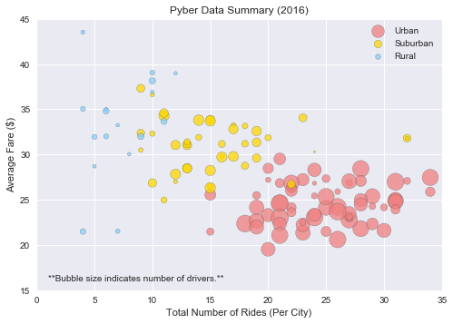
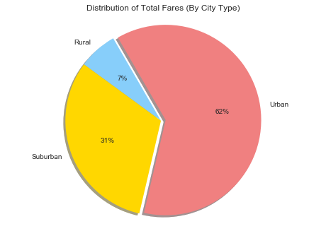
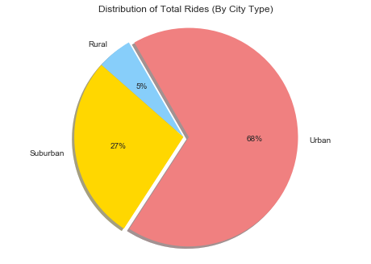
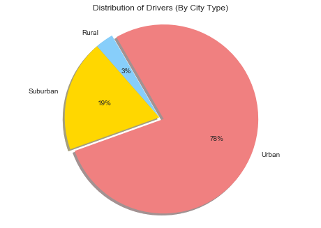

# Pyber Ride Sharing Data


Analysis
- Pyber's business is primarily driven by urban locations, with urban cities making up 62% of all fares, 68% of all rides, and 78% of all drivers.
- Urban cities generally have more rides at a lower average fare than suburban and rural locations.
- More rural locations generally have fewer drivers - urban cities tend to have more drivers than suburban cities, which in turn have more drivers than rural cities.


```python
import os
import pandas as pd
import matplotlib.pyplot as plt
import numpy as np
plt.style.use('seaborn')

# import and review data
city_filepath = os.path.join("raw_data","city_data.csv")
ride_filepath = os.path.join("raw_data","ride_data.csv")

city_data = pd.read_csv(city_filepath)
ride_data = pd.read_csv(ride_filepath)

city_data.head()
```


<div>
<style>
    .dataframe thead tr:only-child th {
        text-align: right;
    }

    .dataframe thead th {
        text-align: left;
    }

    .dataframe tbody tr th {
        vertical-align: top;
    }
</style>
<table border="1" class="dataframe">
  <thead>
    <tr style="text-align: right;">
      <th></th>
      <th>city</th>
      <th>driver_count</th>
      <th>type</th>
    </tr>
  </thead>
  <tbody>
    <tr>
      <th>0</th>
      <td>Kelseyland</td>
      <td>63</td>
      <td>Urban</td>
    </tr>
    <tr>
      <th>1</th>
      <td>Nguyenbury</td>
      <td>8</td>
      <td>Urban</td>
    </tr>
    <tr>
      <th>2</th>
      <td>East Douglas</td>
      <td>12</td>
      <td>Urban</td>
    </tr>
    <tr>
      <th>3</th>
      <td>West Dawnfurt</td>
      <td>34</td>
      <td>Urban</td>
    </tr>
    <tr>
      <th>4</th>
      <td>Rodriguezburgh</td>
      <td>52</td>
      <td>Urban</td>
    </tr>
  </tbody>
</table>
</div>


```python
ride_data.head()
```


<div>
<style>
    .dataframe thead tr:only-child th {
        text-align: right;
    }

    .dataframe thead th {
        text-align: left;
    }

    .dataframe tbody tr th {
        vertical-align: top;
    }
</style>
<table border="1" class="dataframe">
  <thead>
    <tr style="text-align: right;">
      <th></th>
      <th>city</th>
      <th>date</th>
      <th>fare</th>
      <th>ride_id</th>
    </tr>
  </thead>
  <tbody>
    <tr>
      <th>0</th>
      <td>Sarabury</td>
      <td>2016-01-16 13:49:27</td>
      <td>38.35</td>
      <td>5403689035038</td>
    </tr>
    <tr>
      <th>1</th>
      <td>South Roy</td>
      <td>2016-01-02 18:42:34</td>
      <td>17.49</td>
      <td>4036272335942</td>
    </tr>
    <tr>
      <th>2</th>
      <td>Wiseborough</td>
      <td>2016-01-21 17:35:29</td>
      <td>44.18</td>
      <td>3645042422587</td>
    </tr>
    <tr>
      <th>3</th>
      <td>Spencertown</td>
      <td>2016-07-31 14:53:22</td>
      <td>6.87</td>
      <td>2242596575892</td>
    </tr>
    <tr>
      <th>4</th>
      <td>Nguyenbury</td>
      <td>2016-07-09 04:42:44</td>
      <td>6.28</td>
      <td>1543057793673</td>
    </tr>
  </tbody>
</table>
</div>


# Bubble Plot Summary of Data


```python
# build a single data frame and merge on city
rides_by_city = ride_data.groupby("city")
avg_fares = rides_by_city["fare"].mean()
total_rides = rides_by_city["ride_id"].count()

fares_and_rides = pd.DataFrame({"average_fare":avg_fares,"ride_count":total_rides})
fares_and_rides = fares_and_rides.reset_index()

cities_combined = pd.merge(city_data, fares_and_rides, on="city")
cities_combined.head()

# split by city type
urban_cities = cities_combined.loc[cities_combined["type"] == "Urban",:]
suburban_cities = cities_combined.loc[cities_combined["type"] == "Suburban",:]
rural_cities = cities_combined.loc[cities_combined["type"] == "Rural",:]

urban_fares = urban_cities["average_fare"]
urban_drivers = urban_cities["driver_count"]
urban_rides = urban_cities["ride_count"]
suburban_fares = suburban_cities["average_fare"]
suburban_drivers = suburban_cities["driver_count"]
suburban_rides = suburban_cities["ride_count"]
rural_fares = rural_cities["average_fare"]
rural_drivers = rural_cities["driver_count"]
rural_rides = rural_cities["ride_count"]

# build and format scatter plot
plt.scatter(urban_rides, urban_fares, s=urban_drivers*5, c='lightcoral', edgecolor='darkslategray', alpha=0.75)
plt.scatter(suburban_rides, suburban_fares, s=suburban_drivers*5, c='gold', edgecolor='darkslategray', alpha=0.75)
plt.scatter(rural_rides, rural_fares, s=rural_drivers*5, c='lightskyblue', edgecolor='darkslategray', alpha=0.75)
plt.xlim(0,35)
plt.ylim(15,45)
plt.xlabel("Total Number of Rides (Per City)")
plt.ylabel("Average Fare ($)")
plt.title("Pyber Data Summary (2016)")
plt.legend(["Urban","Suburban","Rural"])
plt.text(1,16,"**Bubble size indicates number of drivers.**")
plt.show()
```





# Total Fares by City Type


```python
# group data by city type
cities_combined["total_fares"] = cities_combined["average_fare"]*cities_combined["ride_count"]
city_type_data = cities_combined.groupby("type")

# plot total fares by city type
fares_by_type = city_type_data["total_fares"].sum()
labels = ["Rural","Suburban","Urban"]
colors = ["lightskyblue","gold","lightcoral"]
explode = [0, 0, 0.05]
plt.pie(fares_by_type, labels=labels, colors=colors, explode=explode, autopct='%.0f%%', shadow=True, startangle=120)
plt.axis('equal')
plt.title("Distribution of Total Fares (By City Type)")
plt.show()
```





# Total Rides by City Type


```python
# plot total rides by city type
rides_by_type = city_type_data["ride_count"].sum()
labels = ["Rural","Suburban","Urban"]
colors = ["lightskyblue","gold","lightcoral"]
explode = [0, 0, 0.05]
plt.pie(rides_by_type, labels=labels, colors=colors, explode=explode, autopct='%.0f%%', shadow=True, startangle=120)
plt.axis('equal')
plt.title("Distribution of Total Rides (By City Type)")
plt.show()
```





# Driver Count by City Type


```python
# plot driver count by city type
drivers_by_type = city_type_data["driver_count"].sum()
labels = ["Rural","Suburban","Urban"]
colors = ["lightskyblue","gold","lightcoral"]
explode = [0, 0, 0.05]
plt.pie(drivers_by_type, labels=labels, colors=colors, explode=explode, autopct='%.0f%%', shadow=True, startangle=120)
plt.axis('equal')
plt.title("Distribution of Drivers (By City Type)")
plt.show()
```




